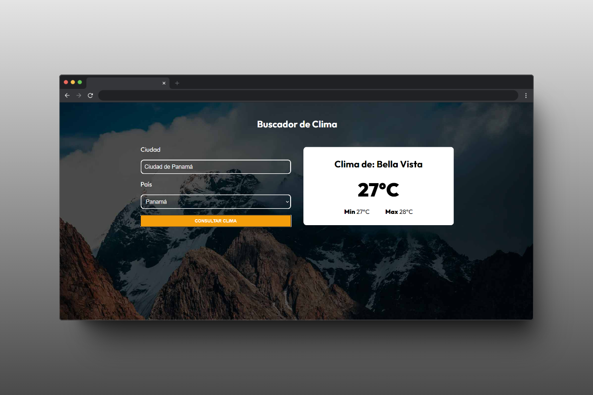
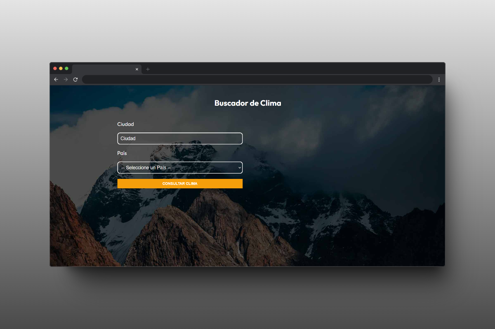
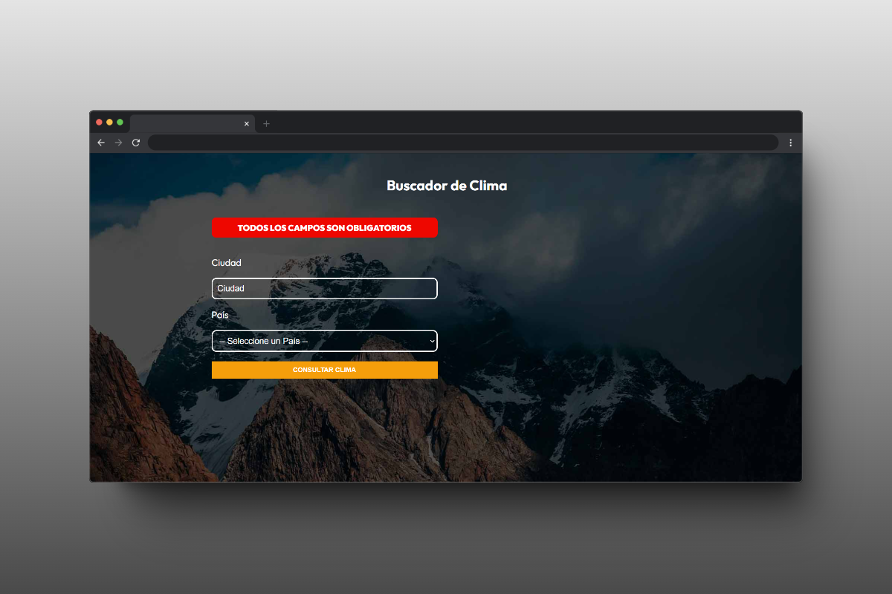
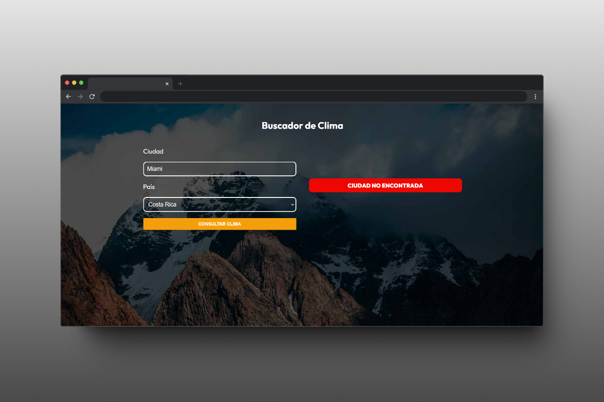

# 🌦️ Weather App

## 📖 Project Description
Weather App is a web application where you can check the weather for various cities around the world with dynamic information fetched from an API.

## 🎨 Project Features
- **City Search**: Search for weather information in many cities around the world.
- **Current Weather**: View the current weather conditions including temperature and it's minimum and maximum temperature.
- **Error Handling**: Displays user-friendly error messages when there are issues with fetching data.
- **Responsive Design**: Optimized for both desktop and mobile devices.

## 🚀 Technologies Used
 

## 📄 Additional Resources

- **Typography**: Utilized Google Fonts for the project's typography.

## 🌐 API Used
The API used for this project is [OpenWeather](https://openweathermap.org/).

## 📚 What I Learned
This is the first project where I learned to securely consume an API, ensuring the JSON response matches the defined types. I also learned various methods to type API results, such as using Types, Type Guards, Zod, or Vailbot. While I am using Zod in this project, other methods are available in the code as examples. Additionally, I learned how to style the project using CSS Modules.

## 🖼️ Screenshots

### Error message if user donsen't adds a city and country

### Error message if city donsen't exists

## 📬 Contact Information

 
 
 
 